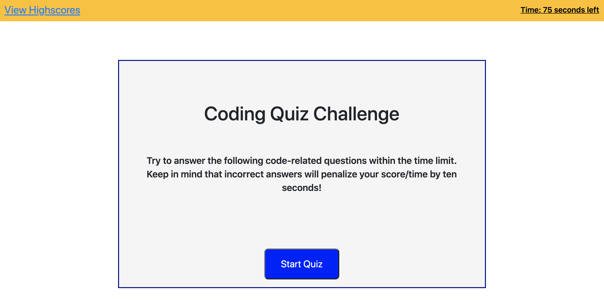
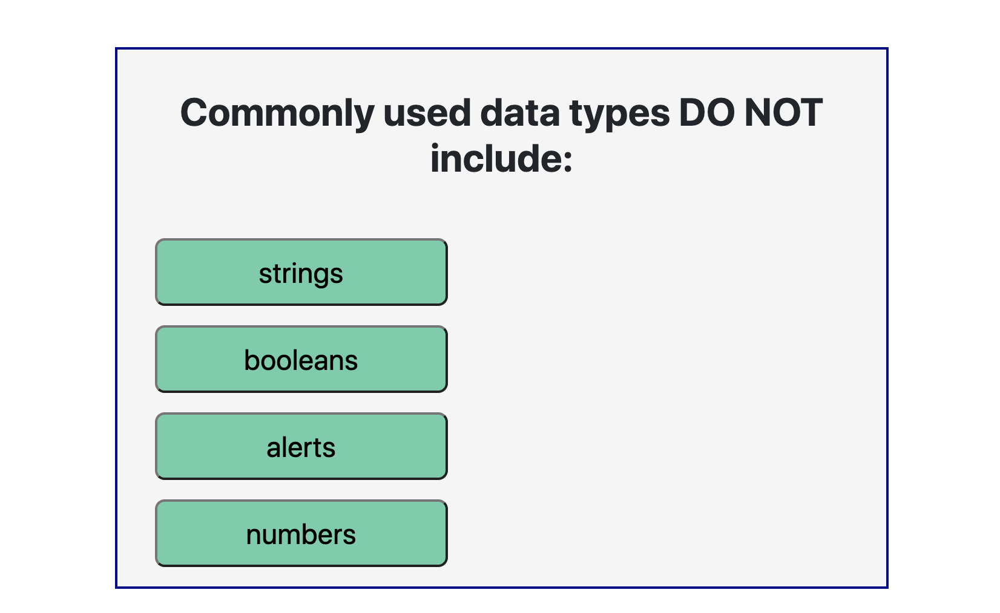
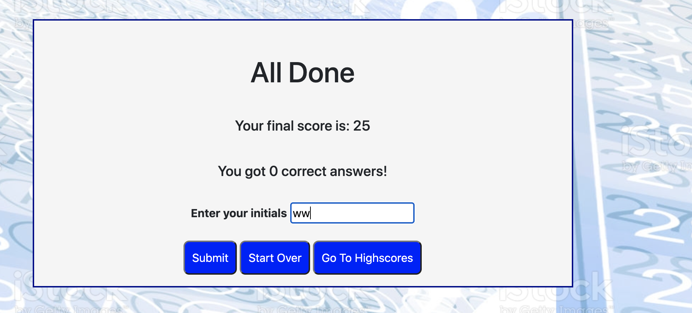
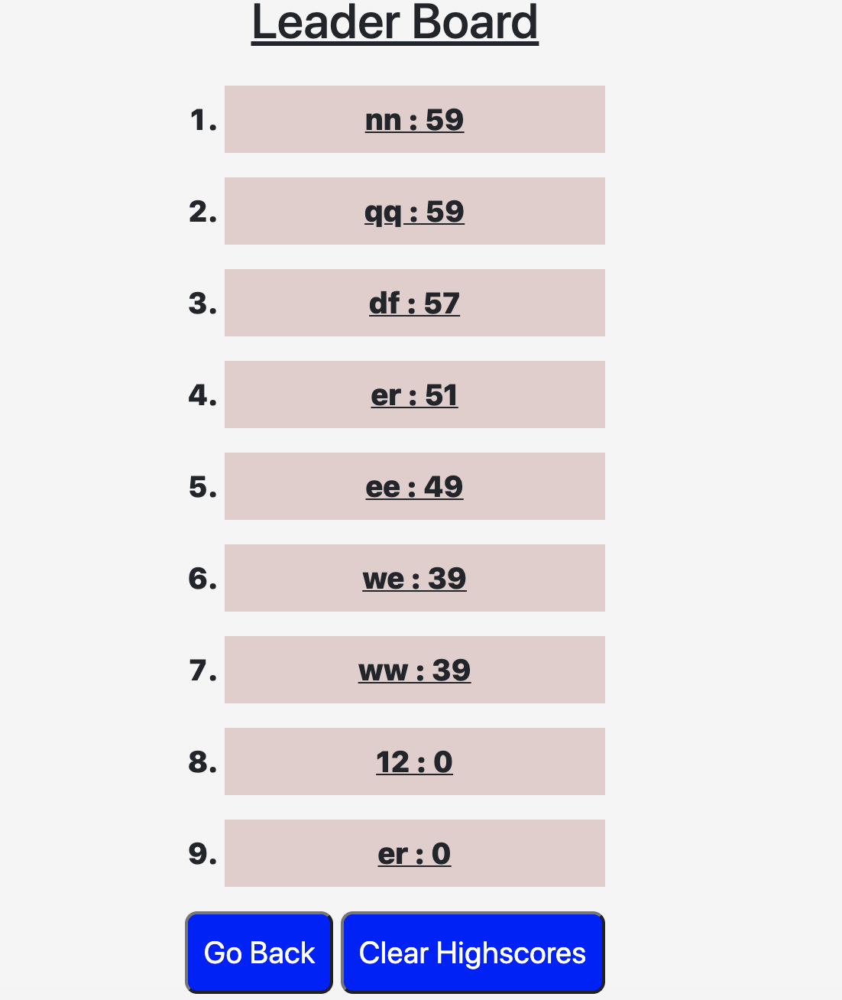
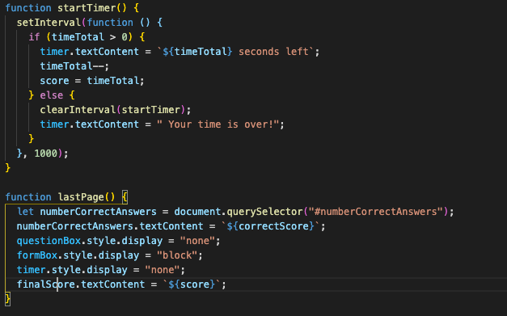

This is a Code Quiz which tests  user's knowledge of basic JavaScript concepts.

The quiz is a multiple-choice and has a timer which determines at the end  how well user answered the questions.

The timer starts when user pushes "Start" button.
If answer is wrong -  application code extracts 10 seconds from total time.
Also, at the end of quiz user will be prompted for initials.They needed to store scores in local storage, which can be accessed by clicking a link.

Here some screenshots that will help understand the flow

Start page with a "Start" button and short decription

Here the page with question's example.When user pushes the button with answer, he(she)
will be redirected to the next question with feedback(Wrong/Correct) under the buttons.

Here is the last Page of quiz with textarea for initials and 2 buttons: 
1. "Submit" - allows you save your score in local storage.
2. "Start Over" - redirects you to the start page.
3. "Go To Highscores" - redirects to page with all scores, sorted by the score(high to low).

If user wants to look at Leaderboard this link at the top of the page needs to be pushed

Here is an  example of Leaderboard, that has 2 buttons:
1. "Go Back" - redirects you to the start page.
2. "Clear Highscores" - allows to clear all scores that page and local storage have.

Here is an example of code that responsable for timer and Last Page of quiz

Technologies, languages, frameworks been used:

1. Javascript - used to dynamically change html and store user-input.
2. HTML - used to create elements on the DOM.
3. CSS - used for styling html elements on page.
4. Query - Used for event listeners of elements as well as to store and recall varibles in local storage to be displayed dynamically in HTML on the page.
5. Bootstrap - used for creating resposive structure and styling for this app.
6. Local storage - used to keep the variables and their values.

My contacts:
1. Email serg.lugovoy.81@gmail.com
2. Phone - +1(954)303-3692

Here is link to the deployed project  https://slugovoy.github.io/code-quiz/

